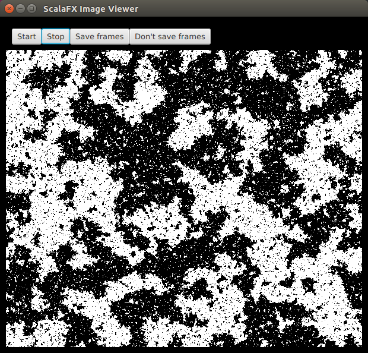

# scala-view

This is a small Scala library for animating a Stream of Images on-screen in a separate window managed by your window manager. It works with both [ScalaFX](http://www.scalafx.org/) `Images` (recommended) and [Scala Swing](https://github.com/scala/scala-swing)/AWT `BufferedImages` (legacy). The stream of images is animated in a window with some simple controls to start and stop the animation, and to turn on and off the saving of image frames to disk (typically for the purpose of turning the image sequence into a movie). An example of what a window might look like is given below.



## Using the package (with SBT)

The binary package is published on the Central repository (AKA Maven Central), and is cross-built for Scala 2.11.x and 2.12.x. To use it with an SBT-based Scala project, add:
```scala
libraryDependencies += "com.github.darrenjw" %% "scala-view" % "0.4"
```
to your SBT build for the "official" release. This is recommended for new users. If you need the latest available snaphot, use
```scala
libraryDependencies += "com.github.darrenjw" %% "scala-view" % "0.5-SNAPSHOT"
```
and note that this will require a sonatype shapshot resolver
```scala
resolvers += "Sonatype Snapshots" at "https://oss.sonatype.org/content/repositories/snapshots/"
```

## Building from source

This is an SBT project, so building from source should be as simple as `sbt package` (assuming that sbt in installed and in your path). Scaladoc documentation can be built with `sbt doc`, etc.

## Using the package in your code

### ScalaFx API (recommended)

The idea is that you create a `Stream` of `Image`s (an instance of `scalafx.scene.image.Image`, such as a `WritableImage`) for your application and then visualise it by calling `scalaview.SfxImageViewer(sbi)` where `sbi` has type `Stream[Image]`. This allows construction of the image stream in a pure functional way. Further details can be found in the ScalaDoc (which can be built with `sbt doc`). Note that it is usually better to use the constructor(s) in the companion object for the `SwingImageViewer` rather than the default class constructor.

#### Examples

Examples of use can be found in the [examples-sfx](examples-sfx/) subdirectory.

### Scala Swing API (legacy)

The idea is that you create a `Stream` of `BufferedImage`s for your application and then visualise it by calling `scalaview.SwingImageViewer(sbi)` where `sbi` has type `Stream[BufferedImage]`. Further details can be found in the scaladoc (which can be built with `sbt doc`). Note that it is usually better to use the constructor(s) in the companion object for the `SwingImageViewer` rather than the default class constructor.

#### Examples

Examples of use can be found in the [examples-swing](examples-swing/) subdirectory.

## Turning frames into a movie

This is not really anything to do with this library, but people keep asking me how to turn a bunch of frames into a movie for incorporating into talk presentations, etc. On Ubuntu, I will often use something like:
```bash
avconv -r 10 -i siv-%06d.png movie.mp4
```
to create a movie at 10 frames per second.

## Copyright

Copyright (C) 2016-2018 Darren J Wilkinson, released under an Apache 2 Open Source license. 

